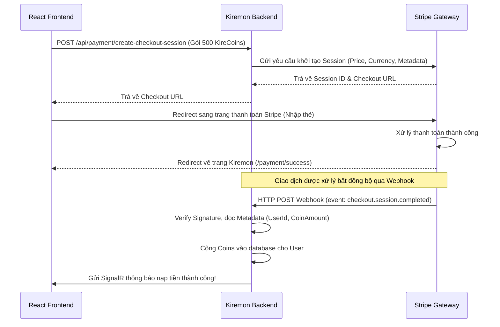

# 🛠️ Third-Party Integrations & Advanced Tech Stack — Kiremon

Tài liệu này đề xuất cách tích hợp các công nghệ và dịch vụ bên thứ 3 (third-party services/middleware) vào dự án **Kiremon** (ASP.NET Core 8 + React). Mục tiêu chính là giúp bạn tìm hiểu, thực hành các công nghệ hiện đại thông qua các bài toán thực tế của game Pokémon.

---

## 📌 Mục lục

1. [Apache Kafka — Kiến trúc Event-Driven & Async Processing](#1-apache-kafka--kiến-trúc-event-driven--async-processing)
2. [n8n — Tự động hóa Quy trình & Webhook Automation](#2-n8n--tự-động-hóa-quy-trình--webhook-automation)
3. [Stripe — Tích hợp Thanh toán & Cửa hàng Premium](#3-stripe--tích-hợp-thanh-toán--cửa-hàng-premium)
4. [SerpAPI — Tra cứu Guide & Tin tức Competitive Pokémon](#4-serpapi--tra-cứu-guide--tin-tức-competitive-pokémon)
5. [Redis — Distributed Caching & Rate Limiting](#5-redis--distributed-caching--rate-limiting)
6. [Cloudinary / AWS S3 — Lưu trữ Ảnh & File CDN](#6-cloudinary--aws-s3--lưu-trữ-ảnh--file-cdn)
7. [OpenTelemetry + Grafana — Giám sát hiệu năng (Observability)](#7-opentelemetry--grafana--giám-sát-hiệu-năng-observability)
8. [Lộ trình học tập đề xuất](#🚀-lộ-trình-học-tập-đề-xuất)

---

## 1. Apache Kafka — Kiến trúc Event-Driven & Async Processing

### 💡 Tại sao nên học?
Kafka là một nền tảng event streaming phân tán cực kỳ phổ biến trong các hệ thống microservices lớn. Học Kafka giúp bạn hiểu cách decouple (giảm sự phụ thuộc) giữa các service, xử lý luồng dữ liệu lớn (high-throughput), cơ chế pub/sub, consumer groups, và đảm bảo tính nhất quán cuối cùng (eventual consistency).

### 🎯 Vị trí tích hợp trong Kiremon
Khi Trainer thực hiện các hành động trong game, thay vì xử lý mọi logic đồng bộ (synchronous) trong HTTP request, backend sẽ đẩy các event lên Kafka. Các Consumer chạy ngầm (BackgroundServices) sẽ tiêu thụ các event này để xử lý các side-effects.

```mermaid
graph TD
    Client[React Frontend] -->|Catch Pokemon / Level Up| API[ASP.NET Core API]
    API -->|Publish Event| Kafka[Apache Kafka Broker]
    
    subgraph Consumers (Background Services)
        Kafka -->|Consume| FeedConsumer[Activity Feed Service]
        Kafka -->|Consume| AchConsumer[Achievement Engine]
        Kafka -->|Consume| NotifConsumer[Notification Service]
    end
    
    FeedConsumer -->|Save to DB| FriendActivityTable[(Friend Activity DB)]
    AchConsumer -->|Check & Unlock| UserAchievements[(Achievements DB)]
    NotifConsumer -->|Push Real-time| SignalR[SignalR Hub / Email]
```

### 🛠️ Hướng dẫn tích hợp & Code ví dụ

Bạn cần cài đặt thư viện NuGet: `Confluent.Kafka`.

#### 1. Định nghĩa Kafka Producer Service
```csharp
// Application/Interfaces/IKafkaProducer.cs
public interface IKafkaProducer
{
    Task PublishEventAsync<T>(string topic, string key, T eventData);
}

// Infrastructure/Services/KafkaProducer.cs
using Confluent.Kafka;
using System.Text.Json;

public class KafkaProducer : IKafkaProducer
{
    private readonly IProducer<string, string> _producer;

    public KafkaProducer(IConfiguration config)
    {
        var producerConfig = new ProducerConfig
        {
            BootstrapServers = config["Kafka:BootstrapServers"] ?? "localhost:9092"
        };
        _producer = new ProducerBuilder<string, string>(producerConfig).Build();
    }

    public async Task PublishEventAsync<T>(string topic, string key, T eventData)
    {
        var message = new Message<string, string>
        {
            Key = key,
            Value = JsonSerializer.Serialize(eventData)
        };
        
        await _producer.ProduceAsync(topic, message);
    }
}
```

#### 2. Trigger Event khi Catch Pokémon
```csharp
// Khi bắt Pokémon thành công trong CatchService
var pokemonCaughtEvent = new PokemonCaughtEvent
{
    UserId = userId,
    TrainerName = user.UserName,
    PokemonName = pokemon.Name,
    IsShiny = pokemon.IsShiny,
    Level = pokemon.Level,
    CaughtAt = DateTime.UtcNow
};

await _kafkaProducer.PublishEventAsync("pokemon-events", userId, pokemonCaughtEvent);
```

#### 3. Tạo Background Consumer để update Achievement
```csharp
// Application/BackgroundServices/AchievementConsumerService.cs
using Confluent.Kafka;
using Microsoft.Extensions.Hosting;

public class AchievementConsumerService : BackgroundService
{
    private readonly IConsumer<string, string> _consumer;
    private readonly IServiceProvider _serviceProvider;

    public AchievementConsumerService(IConfiguration config, IServiceProvider serviceProvider)
    {
        _serviceProvider = serviceProvider;
        var consumerConfig = new ConsumerConfig
        {
            BootstrapServers = config["Kafka:BootstrapServers"] ?? "localhost:9092",
            GroupId = "kiremon-achievement-group",
            AutoOffsetReset = AutoOffsetReset.Earliest
        };
        _consumer = new ConsumerBuilder<string, string>(consumerConfig).Build();
    }

    protected override async Task ExecuteAsync(CancellationToken stoppingToken)
    {
        _consumer.Subscribe("pokemon-events");

        while (!stoppingToken.IsCancellationRequested)
        {
            try
            {
                var consumeResult = _consumer.Consume(stoppingToken);
                var messageJson = consumeResult.Message.Value;
                
                // Phân tích event và xử lý logic kiểm tra Achievement
                using (var scope = _serviceProvider.CreateScope())
                {
                    var achievementService = scope.ServiceProvider.GetRequiredService<IAchievementService>();
                    await achievementService.CheckPokemonCatchAchievementsAsync(messageJson);
                }
            }
            catch (Exception ex)
            {
                // Log lỗi nhưng không làm crash BackgroundService
            }
        }
    }
}
```

---

## 2. n8n — Tự động hóa Quy trình & Webhook Automation

### 💡 Tại sao nên học?
n8n là một công cụ tự động hóa quy trình (workflow automation) dạng mã nguồn mở rất mạnh mẽ, thay thế cho Zapier. Học n8n giúp bạn biết cách tích hợp các hệ thống phân tán thông qua Webhook, thiết kế luồng xử lý tự động (low-code), và kết nối nhanh chóng tới Discord, Slack, Email, Google Sheets mà không cần viết nhiều code backend.

### 🎯 Vị trí tích hợp trong Kiremon
Khi backend xảy ra các sự kiện quan trọng (ví dụ: User mới đăng ký, Shiny Pokémon được bắt, Leaderboard tuần hoàn thành), backend sẽ gửi một HTTP POST (Webhook) chứa payload JSON tới n8n. n8n sẽ thực hiện các workflow được cấu hình trực quan trên UI.

```
+--------------------+            +-----------------+            +-------------------------+
|  Kiremon Backend   |  Webhook   |   n8n Server    |  Workflow  |  - Discord Rich Embed   |
|  (Emit Webhooks)   | ---------> | (Workflow Exec) | ---------> |  - Telegram Alert       |
+--------------------+            +-----------------+            |  - Send Weekly Email    |
                                                                 +-------------------------+
```

### 🛠️ Hướng dẫn tích hợp & Code ví dụ

#### 1. Viết Webhook Service trên Backend (.NET)
```csharp
// Application/Interfaces/IWebhookService.cs
public interface IWebhookService
{
    Task TriggerWebhookAsync(string eventType, object payload);
}

// Infrastructure/Services/WebhookService.cs
using System.Text.Json;

public class WebhookService : IWebhookService
{
    private readonly HttpClient _httpClient;
    private readonly string _n8nWebhookUrl;

    public WebhookService(HttpClient httpClient, IConfiguration config)
    {
        _httpClient = httpClient;
        _n8nWebhookUrl = config["Webhook:n8nUrl"] ?? "http://localhost:5678/webhook/pokemon-events";
    }

    public async Task TriggerWebhookAsync(string eventType, object payload)
    {
        var data = new
        {
            Event = eventType,
            Timestamp = DateTime.UtcNow,
            Data = payload
        };

        var content = new StringContent(JsonSerializer.Serialize(data), System.Text.Encoding.UTF8, "application/json");
        
        // Gửi async dạng fire-and-forget hoặc log lỗi nếu n8n down
        _ = _httpClient.PostAsync(_n8nWebhookUrl, content);
        await Task.CompletedTask;
    }
}
```

#### 2. Cấu hình n8n Workflow (Ý tưởng Node)
1. **Webhook Node (Trigger):** Nhận POST request từ Kiremon.
   - URL: `http://localhost:5678/webhook/pokemon-events`
2. **Switch/If Node:** Kiểm tra loại event.
   - Nếu `Event == "pokemon.shiny_caught"` -> Đi tiếp nhánh A.
   - Nếu `Event == "user.registered"` -> Đi tiếp nhánh B.
3. **Discord Node (Nhánh A):** Gửi một thông báo dạng Rich Embed sinh động vào Discord Server của Kiremon:
   - *Content:* `✨ [Trainer] vừa thu phục được Pokémon Shiny [PokemonName] cấp [Level] tại [Location]! ✨`
4. **Gmail Node (Nhánh B):** Gửi email chào mừng cùng cẩm nang hướng dẫn chơi game cho Trainer mới đăng ký.

---

## 3. Stripe — Tích hợp Thanh toán & Cửa hàng Premium

### 💡 Tại sao nên học?
Stripe là cổng thanh toán hàng đầu thế giới dành cho các nhà phát triển. Học Stripe giúp bạn hiểu quy trình giao dịch trực tuyến an toàn, bảo mật thông tin thẻ (PCI Compliance), cơ chế làm việc của Webhook để cập nhật trạng thái đơn hàng (Fulfillment), và cách xử lý lỗi thanh toán hoặc Refund.

### 🎯 Vị trí tích hợp trong Kiremon
Tạo một cửa hàng Premium trong game:
- Nạp Coins ảo (`KireCoins`) bằng tiền thật qua Stripe.
- Mua các đặc quyền (ví dụ: Premium Trainer status - tăng 5% EXP nhận được, tăng giới hạn Box chứa Pokémon).
- Mua vé tham gia các sự kiện Raid đặc biệt (Raid Ticket).



### 🛠️ Hướng dẫn tích hợp & Code ví dụ

Cài đặt NuGet: `Stripe.net`.

#### 1. Tạo Endpoint khởi tạo Checkout Session
```csharp
// Server/Controllers/PaymentController.cs
using Microsoft.AspNetCore.Mvc;
using Stripe;
using Stripe.Checkout;

[ApiController]
[Route("api/[controller]")]
public class PaymentController : ControllerBase
{
    private readonly IConfiguration _config;

    public PaymentController(IConfiguration config)
    {
        _config = config;
        StripeConfiguration.ApiKey = _config["Stripe:SecretKey"];
    }

    [HttpPost("create-checkout-session")]
    public async Task<IActionResult> CreateCheckoutSession([FromBody] CreateCheckoutDto dto)
    {
        var domain = _config["App:FrontendUrl"] ?? "http://localhost:3000";

        var options = new SessionCreateOptions
        {
            PaymentMethodTypes = new List<string> { "card" },
            LineItems = new List<SessionLineItemOptions>
            {
                new SessionLineItemOptions
                {
                    PriceData = new SessionLineItemPriceDataOptions
                    {
                        UnitAmount = dto.AmountCents, // Ví dụ: 50000 = 50,000 VND
                        Currency = "vnd",
                        ProductData = new SessionLineItemPriceDataProductDataOptions
                        {
                            Name = dto.ProductName,
                            Description = "Mua vật phẩm/nạp tiền cho tài khoản Kiremon"
                        },
                    },
                    Quantity = 1,
                },
            },
            Mode = "payment",
            SuccessUrl = domain + "/payment/success?session_id={CHECKOUT_SESSION_ID}",
            CancelUrl = domain + "/payment/cancel",
            Metadata = new Dictionary<string, string>
            {
                { "userId", dto.UserId },
                { "coinAmount", dto.CoinAmount.ToString() }
            }
        };

        var service = new SessionService();
        Session session = await service.CreateAsync(options);

        return Ok(new { checkoutUrl = session.Url });
    }
}
```

#### 2. Xử lý Stripe Webhook để cộng Coins an toàn
```csharp
[HttpPost("webhook")]
[IgnoreAntiforgeryToken] // Bắt buộc cho Webhook
public async Task<IActionResult> StripeWebhook()
{
    var json = await new StreamReader(HttpContext.Request.Body).ReadToEndAsync();
    var stripeSignature = Request.Headers["Stripe-Signature"];
    var webhookSecret = _config["Stripe:WebhookSecret"];

    try
    {
        var stripeEvent = EventUtility.ConstructEvent(json, stripeSignature, webhookSecret);

        if (stripeEvent.Type == Events.CheckoutSessionCompleted)
        {
            var session = stripeEvent.Data.Object as Session;
            
            // Lấy thông tin từ metadata gửi đi ban đầu
            var userId = session.Metadata["userId"];
            var coinAmount = int.Parse(session.Metadata["coinAmount"]);

            // Cộng tiền vào tài khoản user
            using (var scope = HttpContext.RequestServices.CreateScope())
            {
                var userService = scope.ServiceProvider.GetRequiredService<IUserService>();
                await userService.AddCoinsAsync(userId, coinAmount);
                
                // Gửi Real-time thông báo qua SignalR
                var hubContext = scope.ServiceProvider.GetRequiredService<IHubContext<PresenceHub>>();
                await hubContext.Clients.User(userId).SendAsync("ReceiveCoinUpdate", coinAmount);
            }
        }

        return Ok();
    }
    catch (StripeException e)
    {
        return BadRequest(new { message = "Webhook signature verification failed" });
    }
}
```

---

## 4. SerpAPI — Tra cứu Guide & Tin tức Competitive Pokémon

### 💡 Tại sao nên học?
SerpAPI là một dịch vụ chuyển kết quả tìm kiếm từ các công cụ (Google, YouTube, Baidu,...) thành dữ liệu JSON sạch sẽ. Học SerpAPI giúp bạn giải quyết bài toán thu thập dữ liệu (data collection) từ thế giới bên ngoài mà không lo bị chặn IP, CAPTCHA, hay cấu trúc HTML của Google thay đổi liên tục.

### 🎯 Vị trí tích hợp trong Kiremon
- **Competitive Wiki / Strategy Finder:** Khi xem chi tiết một Pokémon (ví dụ: Garchomp), hệ thống sẽ gọi SerpAPI tìm kiếm các bộ move tốt nhất từ diễn đàn Smogon và hiển thị các link bài viết chất lượng nhất.
- **PokeNews Hub:** Một trang tin tức hiển thị các bài báo mới nhất về Pokémon GO, Pokémon TCG, Pokémon Scarlet/Violet lấy từ Google News.
- **YouTube Guide Embedder:** Tìm kiếm tự động các video hướng dẫn xây dựng đội hình Pokémon đó trên YouTube và nhúng trực tiếp vào game để người dùng học hỏi.

```
+--------------------+               +-------------------+               +---------------+
|   Kiremon Client   |  Garchomp     |  Kiremon Backend  |  Google query |    SerpAPI    |
| (Xem info Pokemon) | ------------> | (Route Search)    | ------------> | (JSON Return) |
+--------------------+               +-------------------+               +---------------+
          ^                                                                      |
          |___________________________ Trả về bài viết/Video ____________________|
```

### 🛠️ Hướng dẫn tích hợp & Code ví dụ

#### Viết Service tích hợp SerpAPI (.NET)
```csharp
// Application/Interfaces/ISerpApiService.cs
public interface ISerpApiService
{
    Task<List<PokemonGuideDto>> GetPokemonGuidesAsync(string pokemonName);
}

// Application/DTOs/PokemonGuideDto.cs
public class PokemonGuideDto
{
    public string Title { get; set; } = string.Empty;
    public string Link { get; set; } = string.Empty;
    public string Snippet { get; set; } = string.Empty;
    public string Source { get; set; } = string.Empty;
}

// Infrastructure/Services/SerpApiService.cs
using System.Text.Json;

public class SerpApiService : ISerpApiService
{
    private readonly HttpClient _httpClient;
    private readonly string _apiKey;

    public SerpApiService(HttpClient httpClient, IConfiguration config)
    {
        _httpClient = httpClient;
        _apiKey = config["SerpApi:ApiKey"] ?? string.Empty;
    }

    public async Task<List<PokemonGuideDto>> GetPokemonGuidesAsync(string pokemonName)
    {
        var guides = new List<PokemonGuideDto>();
        if (string.IsNullOrEmpty(_apiKey)) return guides;

        // Tìm kiếm các bài viết chiến thuật về Pokémon trên Smogon
        var query = Uri.EscapeDataString($"site:smogon.com/dex/ sv strategy {pokemonName}");
        var url = $"https://serpapi.com/search.json?q={query}&api_key={_apiKey}&engine=google";

        var response = await _httpClient.GetAsync(url);
        if (!response.IsSuccessStatusCode) return guides;

        var jsonString = await response.Content.ReadAsStringAsync();
        using var document = JsonDocument.Parse(jsonString);
        
        if (document.RootElement.TryGetProperty("organic_results", out var results))
        {
            foreach (var item in results.EnumerateArray().Take(5)) // Lấy top 5 kết quả
            {
                guides.Add(new PokemonGuideDto
                {
                    Title = item.GetProperty("title").GetString() ?? "",
                    Link = item.GetProperty("link").GetString() ?? "",
                    Snippet = item.TryGetProperty("snippet", out var s) ? s.GetString() ?? "" : "",
                    Source = "Smogon Strategy"
                });
            }
        }

        return guides;
    }
}
```

---

## 5. Redis — Distributed Caching & Rate Limiting

### 💡 Tại sao nên học?
Redis là một cơ sở dữ liệu in-memory cực nhanh, thường được dùng để cache, làm message broker, và quản lý session. Học Redis giúp bạn nâng cao tư duy thiết kế tối ưu hệ thống (system performance), hiểu sự khác biệt giữa In-Memory Cache (trong tiến trình ứng dụng) và Distributed Cache (chia sẻ giữa nhiều server), tránh nghẽn database dưới lượng request lớn.

### 🎯 Vị trí tích hợp trong Kiremon
- **Cache Dữ liệu PokeAPI:** PokeAPI có tốc độ phản hồi khá chậm và bị rate limit. Thay vì lưu tạm bằng `IMemoryCache` (sẽ mất khi restart app), hãy dùng Redis Cache với TTL (Time-To-Live) 24 giờ.
- **Distributed Session & Blacklist Token:** Lưu danh sách các JWT token bị thu hồi khi logout.
- **SignalR Backplane:** Khi chạy nhiều server Kiremon sau Load Balancer, Redis Pub/Sub sẽ đồng bộ các thông báo real-time qua websocket giữa các máy chủ.
- **IP Rate Limiting:** Sử dụng Redis để lưu bộ đếm số lượt gọi API của một IP, chặn tấn công Spam Catch Pokémon.

### 🛠️ Hướng dẫn tích hợp & Code ví dụ

Cài đặt NuGet: `Microsoft.Extensions.Caching.StackExchangeRedis`.

#### 1. Đăng ký Redis trong `Program.cs`
```csharp
builder.Services.AddStackExchangeRedisCache(options =>
{
    options.Configuration = builder.Configuration.GetConnectionString("Redis") ?? "localhost:6379";
    options.InstanceName = "Kiremon_";
});
```

#### 2. Sử dụng Distributed Cache để lưu Pokémon Info
```csharp
using Microsoft.Extensions.Caching.Distributed;
using System.Text.Json;

public class PokemonDataService
{
    private readonly IDistributedCache _cache;
    private readonly IPokeApiClient _pokeApiClient;

    public PokemonDataService(IDistributedCache cache, IPokeApiClient pokeApiClient)
    {
        _cache = cache;
        _pokeApiClient = pokeApiClient;
    }

    public async Task<PokeApiDetailDto?> GetPokemonDetailsAsync(int pokemonId)
    {
        string cacheKey = $"pokemon:{pokemonId}";
        
        // 1. Kiểm tra trong Redis Cache
        var cachedData = await _cache.GetStringAsync(cacheKey);
        if (!string.IsNullOrEmpty(cachedData))
        {
            return JsonSerializer.Deserialize<PokeApiDetailDto>(cachedData);
        }

        // 2. Nếu cache miss, gọi API ngoài
        var pokemonDetail = await _pokeApiClient.FetchFromApiAsync(pokemonId);
        
        if (pokemonDetail != null)
        {
            // 3. Lưu lại vào Redis Cache với thời gian sống 24 giờ
            var cacheOptions = new DistributedCacheEntryOptions
            {
                AbsoluteExpirationRelativeToNow = TimeSpan.FromHours(24)
            };
            
            await _cache.SetStringAsync(
                cacheKey, 
                JsonSerializer.Serialize(pokemonDetail), 
                cacheOptions
            );
        }

        return pokemonDetail;
    }
}
```

---

## 6. Cloudinary / AWS S3 — Lưu trữ Ảnh & File CDN

### 💡 Tại sao nên học?
Lưu trữ ảnh đại diện, banner, tệp tin trực tiếp trên ổ cứng của Web Server (Local Storage) là một phản mẫu thiết kế (anti-pattern) khi scale ứng dụng. Học cách upload file lên Cloud Storage (như Cloudinary hoặc AWS S3) giúp bạn hiểu về Storage Bucket, CDN Delivery, cách ký xác thực bảo mật trước khi upload (Presigned URLs), và tối ưu hóa tài nguyên tĩnh.

### 🎯 Vị trí tích hợp trong Kiremon
- **Trainer Avatar Upload:** Cho phép người dùng upload avatar tùy chỉnh của họ (thay vì chọn avatar mặc định).
- **Custom Box Background:** Người dùng upload ảnh hình nền cho Box chứa Pokémon của họ.
- **Admin Sprite Upload:** Admin tải lên các hình ảnh biến thể Pokémon đặc biệt (Custom Shiny Sprites, Fan-made Pokémon).

### 🛠️ Hướng dẫn tích hợp & Code ví dụ

Cài đặt NuGet: `CloudinaryDotNet`.

#### Viết Service Upload Ảnh lên Cloudinary (Tự động tối ưu dung lượng)
```csharp
// Application/Interfaces/IImageUploadService.cs
public interface IImageUploadService
{
    Task<ImageUploadResultDto> UploadAvatarAsync(IFormFile file, string userId);
}

// Infrastructure/Services/CloudinaryUploadService.cs
using CloudinaryDotNet;
using CloudinaryDotNet.Actions;

public class CloudinaryUploadService : IImageUploadService
{
    private readonly Cloudinary _cloudinary;

    public CloudinaryUploadService(IConfiguration config)
    {
        var account = new Account(
            config["Cloudinary:CloudName"],
            config["Cloudinary:ApiKey"],
            config["Cloudinary:ApiSecret"]
        );
        _cloudinary = new Cloudinary(account);
    }

    public async Task<ImageUploadResultDto> UploadAvatarAsync(IFormFile file, string userId)
    {
        if (file.Length == 0) throw new ArgumentException("File is empty");

        using var stream = file.OpenReadStream();
        
        var uploadParams = new ImageUploadParams
        {
            File = new FileDescription(file.FileName, stream),
            PublicId = $"kiremon/avatars/{userId}",
            Overwrite = true, // Ghi đè nếu đã tồn tại avatar trước đó
            Transformation = new Transformation()
                .Width(250)
                .Height(250)
                .Crop("fill") // Tự động crop ảnh thành hình vuông 250x250
                .Gravity("face") // Nhận diện gương mặt để crop trung tâm
                .Quality("auto") // Tự động nén dung lượng mà không làm vỡ hình
        };

        var uploadResult = await _cloudinary.UploadAsync(uploadParams);

        return new ImageUploadResultDto
        {
            Url = uploadResult.SecureUrl.ToString(),
            PublicId = uploadResult.PublicId
        };
    }
}
```

---

## 7. OpenTelemetry + Grafana — Giám sát hiệu năng (Observability)

### 💡 Tại sao nên học?
Observability (khả năng quan sát) là kỹ năng cốt lõi của một Senior Engineer hay DevOps Engineer. Học OpenTelemetry giúp bạn biết cách thu thập Metrics (thông số đo lường), Traces (vết thực thi của request qua nhiều tầng), và Logs phân tán để phát hiện chính xác nguyên nhân gây chậm API hoặc lỗi nghẽn cổ chai (Bottleneck) trong ứng dụng.

### 🎯 Vị trí tích hợp trong Kiremon
- **PokeAPI Latency Tracker:** Đo lường thời gian phản hồi của API ngoài PokeAPI để xem API này có đang kéo tụt hiệu năng backend của bạn không.
- **EF Core Database Tracing:** Theo dõi các câu lệnh SQL sinh ra bởi EF Core chạy mất bao nhiêu mili-giây, từ đó biết cách tối ưu hóa Index hoặc Query.
- **Game Metrics Dashboard:** Ghi nhận số lượng Pokémon bắt được mỗi phút, số lượng user online thông qua SignalR để vẽ biểu đồ trực quan trên Grafana.

```
 +------------------+                +-------------------------+                +------------------+
 | Kiremon Backend  |  Export Data  | OpenTelemetry Collector |  Scrape/Push   | Prometheus /     |
 | (OpenTelemetry)  | ------------> | (Telemetry Agent)       | -------------> | Jaeger / Grafana |
 +------------------+                +-------------------------+                +------------------+
```

### 🛠️ Hướng dẫn tích hợp & Code ví dụ

Cài đặt các gói NuGet:
- `OpenTelemetry.Extensions.Hosting`
- `OpenTelemetry.Instrumentation.AspNetCore`
- `OpenTelemetry.Instrumentation.Http`
- `OpenTelemetry.Instrumentation.EntityFrameworkCore`
- `OpenTelemetry.Exporter.OpenTelemetryProtocol`

#### Cấu hình OpenTelemetry trong `Program.cs`
```csharp
using OpenTelemetry.Resources;
using OpenTelemetry.Trace;
using OpenTelemetry.Metrics;

builder.Services.AddOpenTelemetry()
    .ConfigureResource(resource => resource.AddService("Kiremon.Backend"))
    .WithTracing(tracing =>
    {
        tracing
            .AddAspNetCoreInstrumentation() // Theo dõi các Request vào API
            .AddHttpClientInstrumentation() // Theo dõi các cuộc gọi tới PokeAPI / SerpAPI
            .AddEntityFrameworkCoreInstrumentation() // Theo dõi các truy vấn SQL xuống DB
            .AddOtlpExporter(options =>
            {
                options.Endpoint = new Uri(builder.Configuration["Otel:CollectorUrl"] ?? "http://localhost:4317");
            });
    })
    .WithMetrics(metrics =>
    {
        metrics
            .AddAspNetCoreInstrumentation()
            .AddHttpClientInstrumentation()
            .AddOtlpExporter();
    });
```

Sau khi cấu hình, bạn có thể chạy một **Prometheus** và **Grafana** bằng Docker Compose để thu thập dữ liệu và xây dựng những Dashboard biểu diễn sức khỏe của ứng dụng cực kỳ chuyên nghiệp.

---

## 🚀 Lộ trình học tập đề xuất

Tùy vào thời gian và mục tiêu học tập, bạn có thể triển khai tích hợp các công nghệ này theo từng nhóm từ dễ đến khó để không bị ngợp:

| Nhóm | Công nghệ đề xuất | Bài toán thực hành đầu tiên | Độ khó | Độ ưu tiên |
| :--- | :--- | :--- | :---: | :---: |
| **Nhóm 1: Tối ưu & Tiện ích** | **Redis**, **Cloudinary** | Cache Pokemon detail & Upload Avatar | 🟢 Dễ | ⭐⭐⭐⭐⭐ |
| **Nhóm 2: Tích hợp Dịch vụ** | **Stripe**, **SerpAPI** | Nạp coins qua cổng thanh toán & Nhúng strategy guide | 🟡 Vừa | ⭐⭐⭐⭐ |
| **Nhóm 3: Tự động hóa** | **n8n (Webhooks)** | Bắn tin Shiny Pokemon lên Discord tự động | 🟡 Vừa | ⭐⭐⭐ |
| **Nhóm 4: Kiến trúc nâng cao** | **Kafka**, **OpenTelemetry** | Chuyển Catch-handling sang Async & Đo đạc hiệu năng query | 🔴 Khó | ⭐⭐⭐ |

---

> [!TIP]
> **Khuyên dùng khi Dev local:** Hãy viết một file `docker-compose.yml` định nghĩa sẵn các Service: **PostgreSQL, Redis, Kafka (với Zookeeper), n8n** để khởi động toàn bộ môi trường lập trình chỉ bằng duy nhất một câu lệnh `docker compose up -d`. Điều này sẽ giúp bạn dễ dàng cấu hình và dọn dẹp tài nguyên sau khi học xong!
